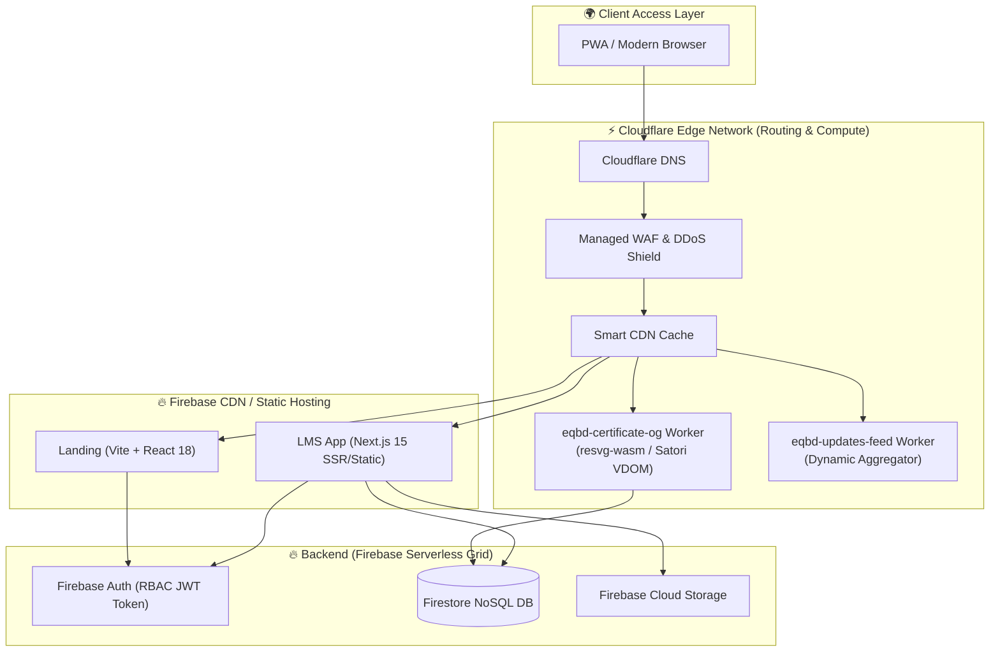
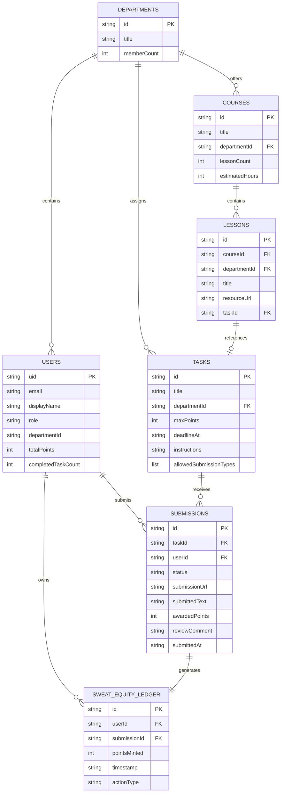
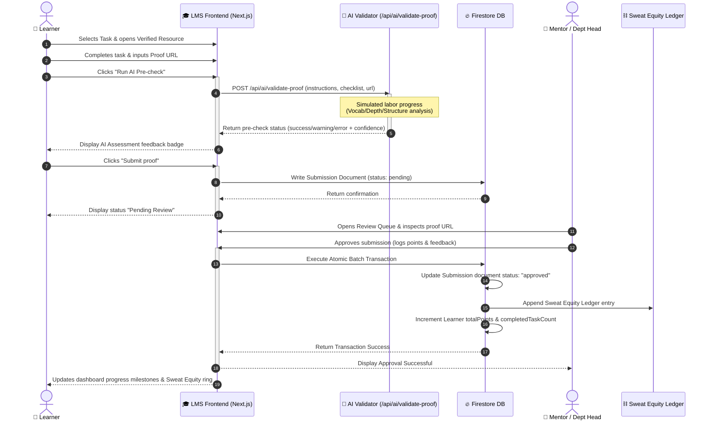

<div align="center">


# EquiSaaS BD: The Sweat Equity Protocol

**We are not building another corporation. We are hard-forking the tech industry.**  
*Bangladesh's First Open-Source Tech Cooperative & Decentralized B2B SaaS Ecosystem.*

[](https://equisaas-bd.com)
[](https://equisaas-bd.com/lms/login)
[](https://reactjs.org/)
[](https://nextjs.org/)
[](https://cloudflare.com/)

</div>

---

## ⚡ The Manifesto

The status quo of the technology sector is fundamentally extractive. Junior developers and designers in developing markets are trapped in unpaid internship loops, producing massive commercial value in exchange for empty certificates. Opportunities and capital remain highly centralized, leaving talent in regional districts locked out of wealth creation.

**EquiSaaS BD is a sovereign, cooperative-governed alternative.**

We run an open-source cooperative platform. Through our **Sweat Equity Protocol**, every hour of audited contribution is converted into permanent, legally binding corporate equity shares. Our builders do not trade hours for zero gain; they own the products they build.

---

## 🧠 System Architecture

Our global infrastructure uses a highly decoupled, multi-cloud topology designed for zero-latency, high availability, and secure edge execution.



---

## 💾 Entity-Relationship Model (ERD)

The database schema maps users, lessons, courses, tasks, and the final sweat equity minting events using strict relational integrity constraints inside Firestore.



---

## 📈 Data Flow Diagram (DFD Level 1)

This flow tracks how user evidence is input, run through automated AI analysis, graded by mentors, and minted into immutable equity ledgers.

```mermaid
graph TD
    User["👤 Learner / Contributor"]
    Reviewer["👥 Department Head / Mentor"]
    
    subgraph Processors ["Data Flow Processors"]
        P1["1.0 Submit Task & Proof"]
        P2["2.0 Run AI Pre-validation"]
        P3["3.0 Assess & Approve Submission"]
        P4["4.0 Mint Sweat Equity Points"]
    end
    
    subgraph DataStores [("Data Stores")]
        DB_Users[("Users Store")]
        DB_Submissions[("Submissions Store")]
        DB_Ledger[("Sweat Equity Ledger")]
    end
    
    User -->|Submits proof URL & notes| P1
    P1 -->|Draft Recovery & Inputs| DB_Submissions
    
    P1 -->|Triggers validation check| P2
    P2 -->|Reads Task Instructions| DB_Submissions
    P2 -->|Returns AI Pre-check feedback| User
    
    DB_Submissions -->|Presents pending queue| P3
    Reviewer -->|Reviews evidence & logs grade| P3
    P3 -->|Updates submission status| DB_Submissions
    
    P3 -->|Triggers atomic transactions| P4
    P4 -->|Appends Ledger Block| DB_Ledger
    P4 -->|Increments Total Points| DB_Users
```

---

## 👥 Use Case Map

Interaction models showing exact boundaries and access permissions between standard Members, Mentors, and Administrators.

```mermaid
leftToRightDirection
graph TD
    Member["👤 Member (Learner/Builder)"]
    Mentor["👥 Mentor / Department Head"]
    Admin["⚙️ Super Administrator"]

    subgraph UseCases ["EquiSaaS BD Core Capabilities"]
        UC_Register["Register & Select Department"]
        UC_BrowseCourses["Browse Courses & Lessons"]
        UC_ValidateAI["Run AI Pre-check Validation"]
        UC_SubmitProof["Submit Task Proof of Work"]
        UC_ReviewSubmissions["Review Submissions Queue"]
        UC_ManageAccess["Manage Roles & Permissions"]
        UC_MintEquity["Mint Sweat Equity Ledger Points"]
        UC_GenerateCert["Generate HD Certificate OG Image"]
    end

    Member --> UC_Register
    Member --> UC_BrowseCourses
    Member --> UC_ValidateAI
    Member --> UC_SubmitProof
    Member --> UC_GenerateCert

    Mentor --> UC_ReviewSubmissions
    Mentor --> UC_MintEquity

    Admin --> UC_ManageAccess
    Admin --> UC_MintEquity
```

---

## ⏱️ Core Protocol Sequence Diagram

Execution loop detailing task progression, AI precheck loops, manual mentor approval, and atomic points minting.



---

## 🛠️ Tech Stack & Micro-services

We engineer for stability, accessibility, and high performance.

- **Frontend Core**: Vite + React 18 for high-impact, high-conversion landing presentation.
- **Member Engine**: Next.js 15 + React 19 for modular, server-rendered LMS portals.
- **Edge Layer**: Cloudflare Workers for caching, dynamic content delivery, and custom aspect-ratio Open Graph (OG) image generation (via `resvg-wasm` and Satori).
- **Backend Architecture**: Firebase Auth (zero-trust RBAC), Cloud Firestore (NoSQL, server-side atomic constraints), Cloud Storage.
- **Cognitive UX**:
  - **Goal Gradient Effect**: Progressive milestone bars loaded with artificial start values (15%) to boost onboarding momentum.
  - **Zeigarnik Effect**: Active checklist loops and visual tension metrics prompting users to resolve incomplete tasks.
  - **Labor Illusion**: Perceived value spinners simulating server workloads during submission security steps and AI pre-checks.
  - **Scarcity & Urgency**: Live counters of active members and ticking cycle countdowns for intake closing.

---

## 🚀 Getting Started

### Local Setup
```bash
# Clone the protocol OS
git clone https://github.com/EquiSaaS-BD/equisaas-bd.git

# Install ecosystem-wide dependencies
npm install
cd landing && npm install
cd ../lms && npm install
cd ..

# Spin up development environments
npm run dev:landing   # Vite Corporate Hub (Port 5173)
npm run dev:lms       # Next.js Builder Portal (Port 3000)
```

### Global Releases
We run a single-command deploy pipeline to release static landing assets, LMS updates, and purge our global Cloudflare CDNs:
```bash
npm run release:hosting
```

---

<div align="center">
  <br/>
  <i>"Code wins arguments. Equity wins the future."</i>
  <br/><br/>
  <b>EquiSaaS BD Core Engineering Team</b>
</div>
